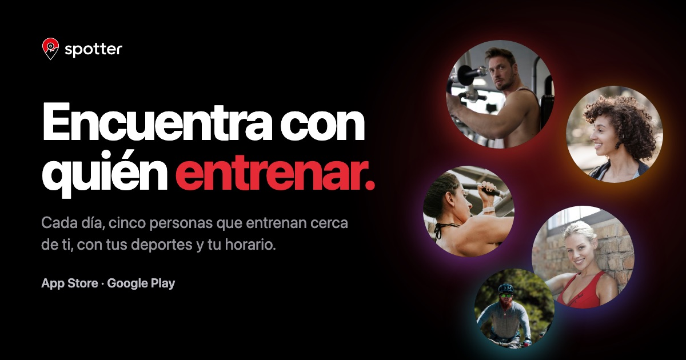

<p align="center">
  
</p>

# Web de Spotter

La web de [Spotter](https://spotterapp.es), la app para encontrar con quién entrenar:
cada día, cinco personas que entrenan cerca de ti, con tus deportes y tu horario.

Hecha con **[Astro](https://astro.build) + TypeScript + CSS**, sin librerías de
interfaz. Estática, en español e inglés y con unos 7 KB de JavaScript en total.

> La guía de marca y el brief de producto de la app son documentos internos y no
> están en este repositorio. Quien trabaje en la web los recibe aparte y los
> guarda en `docs/`, que git ignora.

## Arrancarlo

```bash
npm install
npm run dev
```

Queda en `http://localhost:4321`.

| Orden | Qué hace |
|---|---|
| `npm run dev` | Servidor de desarrollo, recarga al guardar |
| `npm run build` | Genera el sitio estático en `dist/` |
| `npm run preview` | Sirve `dist/` como se verá publicado |
| `npm run check` | Revisa los tipos. **Tiene que dar cero de todo** |
| `npm run comprobar` | Simula las burbujas y falla si se superponen |
| `sh scripts/imagenSocial/generar.sh` | Vuelve a generar la imagen para compartir la web (necesita Google Chrome) |

## Cómo está organizado

La regla es una sola: **la lógica no sabe que existe una pantalla, y la vista no
toma decisiones.** Es el mismo reparto de la app de iPhone, con otros nombres.

```
src/
  domain/     Lógica y datos puros: burbujas, equipo, enlaces, SEO
  i18n/       Los textos, uno por idioma, y la conversión de rutas
  assets/     Imágenes que Astro optimiza: capturas de la app y fotos del equipo
  content/    Documentos largos en Markdown (los legales)
  styles/     tokens.css (colores, espaciado, radios, movimiento) y base.css
  components/ Vistas sin JavaScript de cliente
  islands/    Vistas que sí llevan JavaScript
  scripts/    Comportamientos compartidos del navegador (inclinar con el puntero)
  layouts/    El armazón de página
  pages/      Una ruta del sitio por fichero
```

**Si un componente necesita una regla de negocio, esa regla se va a `domain/`.**
Por eso la física de las burbujas está en `domain/bubbleField.ts` y no dentro del
componente que las dibuja: se puede probar sin navegador.

**`islands/` existe para que se vea el coste de un vistazo.** Todo lo que hay ahí
descarga JavaScript; todo lo demás es HTML servido tal cual. El sitio entero
envía unos **7 KB de JavaScript**.

**Buena parte del movimiento no usa JavaScript**: las apariciones al bajar, la
barra que se vuelve cristal y las cintas en movimiento son CSS. El manifiesto sí
usa unas líneas de guion, porque con CSS solo no funcionaba en el iPhone. En los navegadores que no lo entienden, el
contenido simplemente está ahí, quieto.

## La portada, sección a sección

| Sección | Fichero | Qué tiene de vivo |
|---|---|---|
| Portada | `components/HeroSection` + `islands/BubbleCanvas` | Burbujas que se cogen, se lanzan y esquivan el ratón. Sin rótulos ni botones alrededor: solo las tiendas destacan |
| Cintas | `components/SportsMarquee` | Deportes y «Spot · Body · Mind · Repeat» en movimiento continuo, también con el ratón encima |
| Cómo funciona | `islands/HowItWorksStory` | En escritorio el iPhone se queda fijo y cambia de pantalla según el paso que lees |
| Manifiesto | `islands/ManifestoSection` | La frase se queda fija y se enciende palabra a palabra al bajar, también en móvil |
| Tu gimnasio, exacto | `islands/GymSection` | La palabra del titular va cambiando y el «+10.000» cuenta desde cero |
| Dar un Spot | `components/SpotSection` + `islands/SpotDemo` | Demo que se pulsa: envías el Spot y te contestan |
| Comunidad | `components/CommunitySection` | Píldoras de cristal flotando alrededor del teléfono |
| Seguridad | `components/PrivacySection` | Solo lo que la app ya hace |
| Equipo | `components/TeamSection` | Tarjetas que se inclinan con el puntero |
| Preguntas | `components/FaqSection` | Desplegables nativos, sin JavaScript |
| Descarga | `components/DownloadSection` + `islands/FloatingDownloadBar` | La foto se acerca al bajar; barra de descarga flotante entre medias |

## SEO

Todo lo que leen Google y las redes sociales, y dónde está:

| Qué | Dónde | Para qué |
|---|---|---|
| Título y descripción de cada idioma | `src/i18n/es.ts` y `en.ts`, en `meta` | Lo que sale en el resultado de Google. Máximo 60 y 155 caracteres |
| Cabecera de todas las páginas | `src/layouts/BaseLayout.astro` | Canónica, idiomas (`hreflang`), Open Graph, aviso de la app en Safari |
| Datos estructurados | `src/domain/structuredData.ts` | Organización, web, app y preguntas frecuentes, en el formato de Google |
| Mapa del sitio | `src/pages/sitemap.xml.ts` | Se genera al compilar con las páginas indexables |
| `robots.txt` | `src/pages/robots.txt.ts` | Deja rastrear todo y señala el mapa |
| Imagen al compartir | `public/og/` y `scripts/imagenSocial/` | 1200 × 630, una por idioma |
| Redirecciones de la web antigua | `public/_redirects` | Que las direcciones de WordPress no den error al cambiar de web |

Reglas:

1. **Las direcciones siempre acaban en barra** (`/descarga/`). La canónica, los
   idiomas y el mapa las sacan de la misma función (`localizedPath`): para Google,
   `/descarga` y `/descarga/` son páginas distintas.
2. **Nada de datos inventados** en los datos estructurados. Falta el precio de la
   app a propósito: se añade cuando el equipo lo confirme.
3. **Los borradores no se publican.** Una página legal con `needsLegalReview: true`
   no se genera, no entra en el mapa del sitio y su enlace no sale en el pie. Al
   ponerla a `false`, aparece sola.
4. **`/descarga/` no se puede borrar**: es el enlace de la bio de Instagram.

## Publicar en Netlify

La configuración está en `netlify.toml` (compilación, versión de Node y
cabeceras) y las redirecciones en `public/_redirects`. Al conectar el
repositorio, Netlify lo lee solo.

**Cuidado con el plan gratuito**: los límites son **de todo el equipo**, no de
cada web. Cada publicación en producción gasta créditos, y si se acaban **se
paran todas las webs del equipo** hasta el mes siguiente, también
arrobaeveryone.com. Por eso conviene no publicar con cada `git push` a `main`.

Después de publicar, en **Google Search Console**: verificar el dominio y enviar
`https://spotterapp.es/sitemap.xml`.

## Reglas que no se saltan

1. **Ningún color ni medida a mano.** Si no está en `styles/tokens.css`, es que
   todavía no es una decisión de diseño.
2. **La web es solo oscura**, como la app. No hay modo claro.
3. **Vocabulario de Spotter 2.0.** Se da un **Spot**; cuando la otra persona
   contesta, es un **Spot confirmado**; la selección diaria es **tu serie**.
   Prohibido: *match, like, corazón, swipe, deslizar, ligar, cita*.
4. **No prometer lo que la app no hace** (brief, §3): nada de notificaciones,
   quedadas en la app, historias, Apple Watch ni cifras de usuarios. (La 2.0 sí
   estará en las dos tiendas: lo confirmó Juan el 14/09/2026.)
5. **Las burbujas no llevan aro.** Solo un halo del color del deporte (brief, §5).
6. **El cristal es para controles**, nunca para contenido, y nunca cristal sobre
   cristal. Un solo botón rojo por sección.
7. **Los dos idiomas van juntos.** Una clave en `i18n/es.ts` sin traducir en
   `i18n/en.ts` **rompe la compilación**. Es a propósito.

## Imágenes

| Dónde | Qué hay | Origen |
|---|---|---|
| `src/assets/capturas/` | 8 pantallas de la app (14/09/2026) | Brief de la 2.0. Las personas son Juan y amigos suyos, autorizadas. Salen en WebP y a varios tamaños |
| `src/assets/equipo/` | Vuestras fotos | **Vacía**: ver su `LEEME.md` |
| `public/brand/` | Logotipos y símbolo | La agencia, con dos arreglos: ver su `LEEME.md` |
| `public/badges/` | Distintivos oficiales de App Store y Google Play, en español e inglés | Apple y Google, sin modificar |
| `public/perfiles/` | Caras de las burbujas | Pexels, licencia libre. **De relleno** |
| `public/ambiente/` | Foto del cierre | Pexels, licencia libre. **De relleno** |

**Para poner vuestras fotos** basta con soltar `paula.jpg`, `juan.jpg` y
`pablo.jpg` en `src/assets/equipo/`. No hay que tocar código.

## Lo que falta, y quién lo decide

| Pendiente | Dónde se cambia |
|---|---|
| Fotos del equipo | `src/assets/equipo/` |
| Correo de contacto que atiende Paula | `src/domain/links.ts` |
| Respuestas de precio, ciudades y fechas para las preguntas | `src/i18n/es.ts` y `en.ts` |
| Revisión legal de los términos (la privacidad ya enlaza la publicada) | `src/content/legal/` |

## Licencia

© Spotter. Todos los derechos reservados. El código es público para poder
consultarlo, pero la marca, los textos y las imágenes no se pueden reutilizar.
